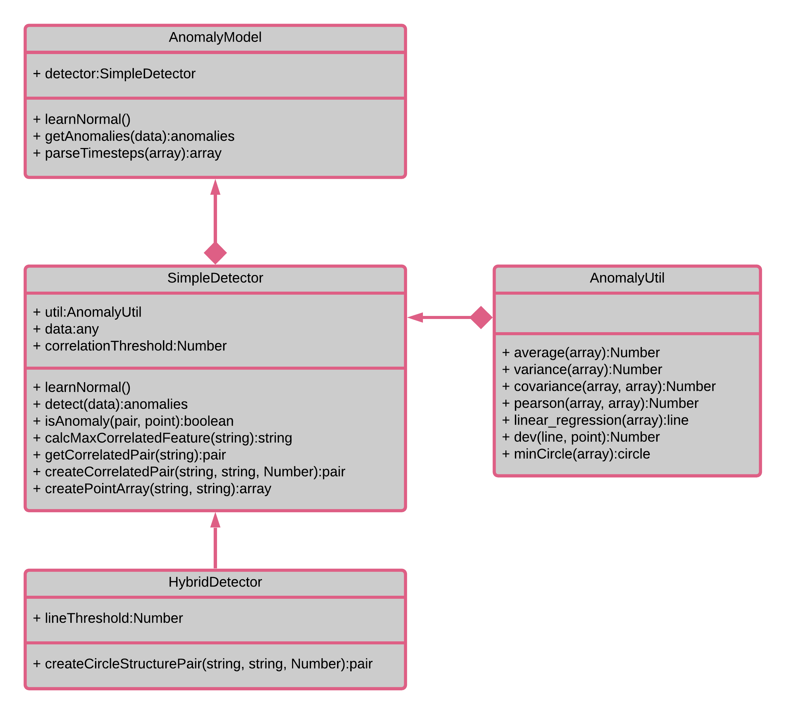
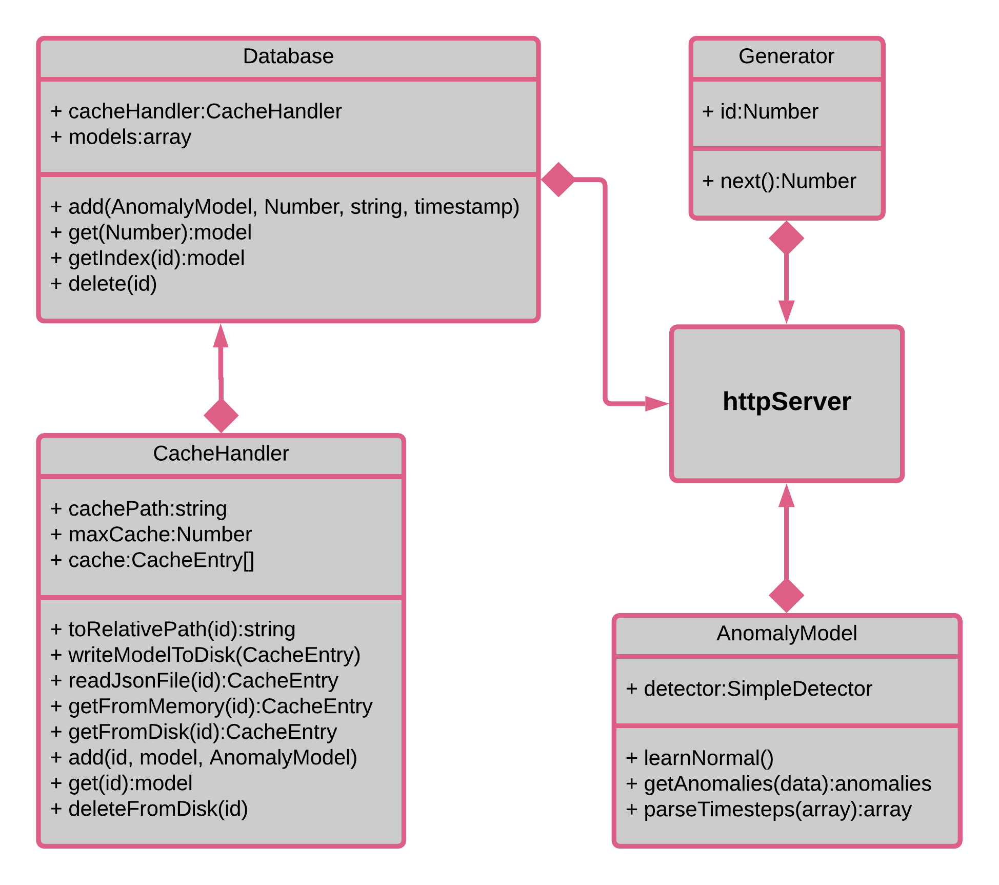
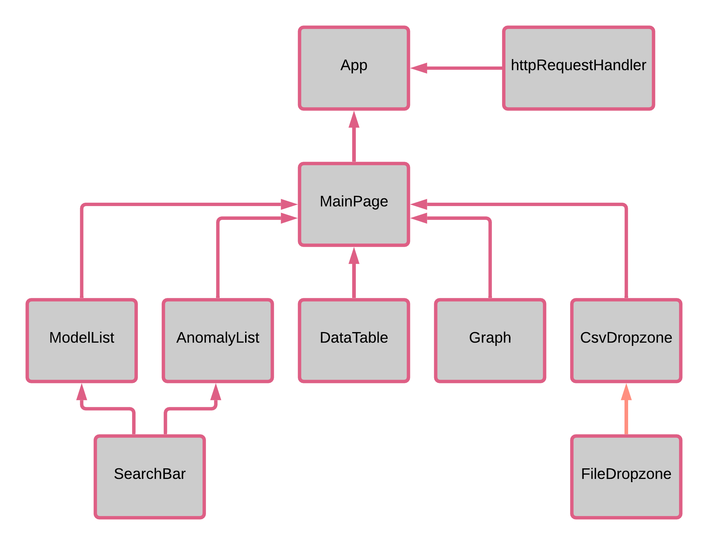

# Web Anomaly Analyzer v1.0


## Table of Contents
* [1. Introduction](#1-introduction)
* [2. Dependencies](#2-dependencies)
* [3. Installation and Usage](#3-installation-and-usage)
  * [3.1. Setup](#31-setup)
  * [3.2. User Guide](#32-user-guide)
  * [3.3. Building the website](#33-building-the-website)
* [4. Diagrams](#4-diagrams)
  * [4.1. Anomaly Detection](#41-anomaly-detection)
  * [4.2. HTTP Server](#42-http-server)
  * [4.3. Website Component Hierarchy](#43-website-component-hierarchy)
* [5. API Specification](#5-api-specification)
  * [5.1. Data](#51-data)
    * [5.1.1. \<MODEL>](#511-model)
    * [5.1.2. \<DATA>](#512-data)
    * [5.1.3. \<ANOMALY>](#513-anomaly)
  * [5.2. Requests](#52-requests)
    * [5.2.1. Get all models](#521-get-all-models)
    * [5.2.2. Get a model](#522-get-a-model)
    * [5.2.3. Delete a model](#523-delete-a-model)
    * [5.2.4. Upload a new model](#524-upload-a-new-model)
    * [5.2.5. Get anomalies](#525-get-anomalies)
* [6. Contributors](#6-contributors)
* [7. Links and Demonstration Video](#7-links-and-demonstration-video)

***

# 1. Introduction

This project consists of a server and a web client. The project allows the user to detect and observe the anomalies in their data.

## This Version includes

* Node.js Express RESTful HTTP server:
  * Exposes a simple API for clients using REST-style requests.

  * Reads and caches the client's training data and live data.

  * Analyzes the data and provides a list of anomalies.

  * Able to service multiple clients simultaneously. 

* React web client:
  * Easy-to-use UI (buttons and file dropzones).

  * Communication with the anomaly analysis server.

  * Conversion of raw json data into beautiful graphs.

  * Data table that displays the relevant data and highlights rows that contain an anomaly.

***

# 2. Dependencies

In order to increase backward compatibility:

* [Node.js 14.16.1](https://nodejs.org/en/download/) is used to run the server
* Packages - Server
  * [await-semaphore v0.1.3](https://www.npmjs.com/package/await-semaphore)
  * [cors v2.8.5](https://www.npmjs.com/package/cors)
  * [express 4.17.1](https://www.npmjs.com/package/express)
* Packages - Client
  * [smallest-enclosing-circle v1.0.2](https://www.npmjs.com/package/smallest-enclosing-circle)
  * [@material-ui/core v4.11.4](https://www.npmjs.com/package/@material-ui/core)
  * [@material-ui/icons v4.11.2](https://www.npmjs.com/package/@material-ui/icons)
  * [react-chartjs-2 v3.0.3](https://www.npmjs.com/package/react-chartjs-2)

***

# 3. Installation and Usage

## 3.1. Setup

* Clone the repo
  ```bash
  git clone https://github.com/yarin-da/adv_prog_2_web.git
  ```

* Go to the `http_server` folder 

* Install the required packages
  ```bash
    npm install await-semaphore
    npm install cores
    npm install express
  ```

* Run the server
  ```bash
  node http_server.js
  ```

* The server is now up and running.
  * If the server and client are running on the same machine: you may type `localhost:9876` into your browser.
  * otherwise, changed `localhost` to your server's IP address.

## 3.2. User Guide

* Upload a training data file using the file dropzone in the bottom-left corner.

* Select your desired model in the lower list (Model List).

* Upload a flight data file (i.e. data to analyze) using the file dropzone at the top-left.

* Click on an anomaly (if there is any) in the higher list (Anomaly List).

## 3.3. Building the website

This section is not mandatory. It is useful for users who want to change/build the website themselves.

* Open the terminal in the `web_client` folder.
* Build the website
```bash
    npm run build
```
  * If the build fails - you may need to install the packages that are mentioned in the Dependencies section.
* Move the files in the `web_client/build` to `http_server/public`.

# 4. Diagrams

## 4.1. Anomaly Detection


This diagram shows the design of the anomaly detection algorithms. `AnomalyModel` class has been created as a facade for this whole process in order to decouple `httpServer` from the actual implementation of the algorithms. That way, swapping/adding algorithms would be easier in the future.

## 4.2. HTTP Server



This diagram shows the classes that are used in `httpServer` directly. 

Note that `httpServer` doesn't use `CacheHandler` directly. `Database` acts as a basic wrapper for cache handling, incase we'd want to support different kind of caches (i.e. via network).

## 4.3. Website Component Hierarchy



This diagram shows the hierarchy between the React components.

***

# 5. API Specification

## 5.1. Data

### 5.1.1. \<MODEL>

* `model_id` [Number] - a unique id for the model.

* `upload_time` [String] - timestamp of model upload to the server in format `"yyyy-mm-ddThh:mm:ssZ"`, where `Z` is the timezone offset of the server.

* `status` [String] - `"ready"` if training (learning) process has finished, otherwise `"pending"`.

Example:
```javascript
{ 
  model_id: 13, 
  upload_time: "2021-02-23T19:23:58+3:00",
  status: "pending"
}
```

### 5.1.2. \<DATA>

This object contains all the information from the user's csv file.

* Each key would be a header of a column (type string).

* The value of a key would be an array of the column's data (in line order). 

Example:
```javascript
  {
    "altitude_gps": [100, 110, 20, 120...],
    "heading_gps": [0.6, 0.59, 0.54, 0.51...],
    ...
  }
```

### 5.1.3. \<ANOMALY>

* `anomalies` 
  * Each key is a feature's name, and its value is a `span`.
  * `span` is an array, where each cell is an array of two integer values (start, end), that signify and timestep period of when the anomaly occurred.

* `reason` - 
  * Each key is a feature's name.
  * Each value is the most correlated feature for the corresponding key.

Example:
```javascript
  {
    anomalies: {
      "air_speed": [[2,3], ...],
      ...
    },
    reason: {
      "air_speed": "heading_deg",
      ...
    }
  }
```

## 5.2. HTTP Requests

### 5.2.1. Get all models

```
Action: GET
Path: /api/models
Parameters: None
body: None
Response: [<MODEL>, <MODEL>, ...]
```

### 5.2.2. Get a model

```
Action: GET
Path: /api/model
Parameters: model_id
body: None
Response: <MODEL>
```

### 5.2.3. Delete a model

```
Action: DELETE
Path: /api/model
Parameters: model_id
body: None
Response: 404 if not found, otherrwise 200.
```

### 5.2.4. Upload a new model

```
Action: POST
Path: /api/model
Parameters: model_id
body: <DATA>
Response: <MODEL>
```

### 5.2.5. Get anomalies

```
Action: POST
Path: /api/anomaly
Parameters: model_id
body: <DATA>
Response: 
  <ANOMALY> if the model is ready, otherwise
  redirect GET /api/model?model_id={model_id}
```

***

# 6. Contributors

* [Belo Coral](https://github.com/coralbelo)
* [Dado Yarin](https://github.com/yarin-da)
* [Katav Adi](https://github.com/AdiKatav)
* [Solomon Yasmin](https://github.com/yasmin15)

***

# 7. Links and Demonstration Video

* [Node.js 14.16.1](https://nodejs.org/en/download/)
* [await-semaphore v0.1.3](https://www.npmjs.com/package/await-semaphore)
* [cors v2.8.5](https://www.npmjs.com/package/cors)
* [express 4.17.1](https://www.npmjs.com/package/express)
* [smallest-enclosing-circle v1.0.2](https://www.npmjs.com/package/smallest-enclosing-circle)
* [@material-ui/core v4.11.4](https://www.npmjs.com/package/@material-ui/core)
* [@material-ui/icons v4.11.2](https://www.npmjs.com/package/@material-ui/icons)
* [react-chartjs-2 v3.0.3](https://www.npmjs.com/package/react-chartjs-2)

## [Demonstration Video](https://youtu.be/vkNnaMs7ALU)