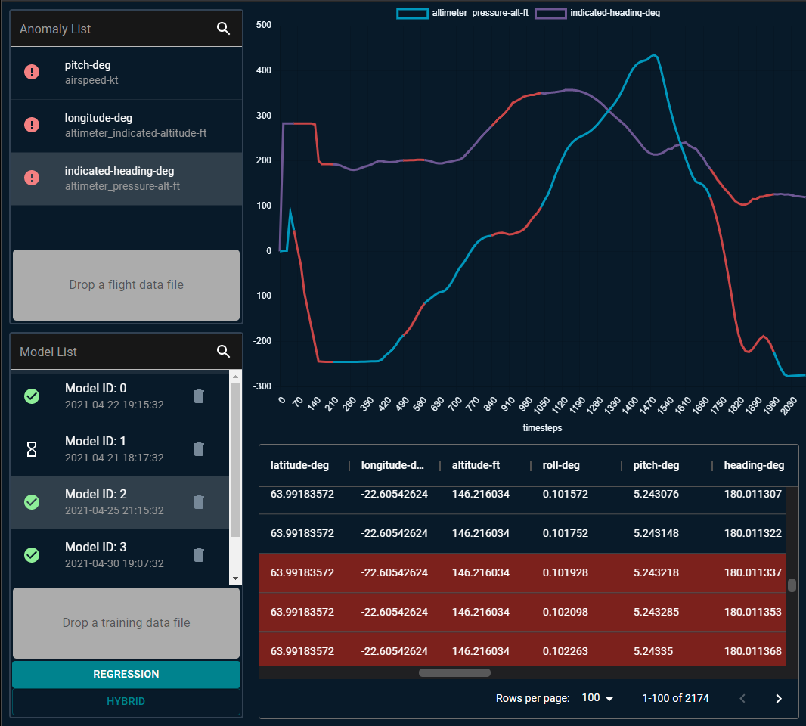

# Web Anomaly Analyzer v1.0



<!-- TODO: update TOC -->
## Table of Contents
* [1. Introduction](#1-introduction)
* [2. Dependencies](#2-dependencies)
* [3. User Guide](#3-user-guide)
  * [3.1. How To Use](#31-how-to-use)
* [4. Diagrams](#4-diagrams)
* [5. Contributors](#5-contributors)
* [6. Links and Demonstration Video](#6-links-and-demonstration-video)

***

# 1. Introduction

The project is made of two components: 
* RESTful HTTP server. The server is able to analyze flight data and find anomalies. It also provides a simple easy-to-use interface for clients using REST-style requests.
* Web client with intuitive design and beautiful UI. <!-- TODO -->

## This Version includes

* Node.js Express RESTful HTTP server:
  * 
* React web client:
  * 

***

# 2. Dependencies

In order to increase backward compatibility:

* [Node.js 14.16.1](https://nodejs.org/en/download/) is used to run the server

***

# 3. User Guide

## 3.1. How To Use

* Clone the repo
```bash
git clone https://github.com/yarin-da/adv_prog_2_web.git
```

* Go to the `http_server` folder 

* Use Node.js to run the server
<!-- TODO -->
```bash
node http_server.js
```

# 4. Diagrams
<!-- TODO -->

***

# 5. Contributors

* [Belo Coral](https://github.com/coralbelo)
* [Dado Yarin](https://github.com/yarin-da)
* [Katav Adi](https://github.com/AdiKatav)
* [Solomon Yasmin](https://github.com/yasmin15)

***

# 6. Links and Demonstration Video

* [Node.js 14.16.1](https://nodejs.org/en/download/)

## Demonstration Video
<!-- TODO -->